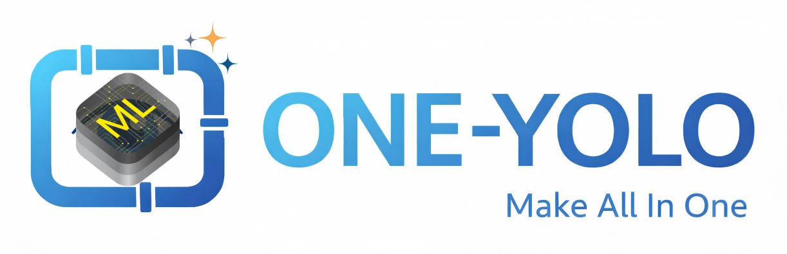
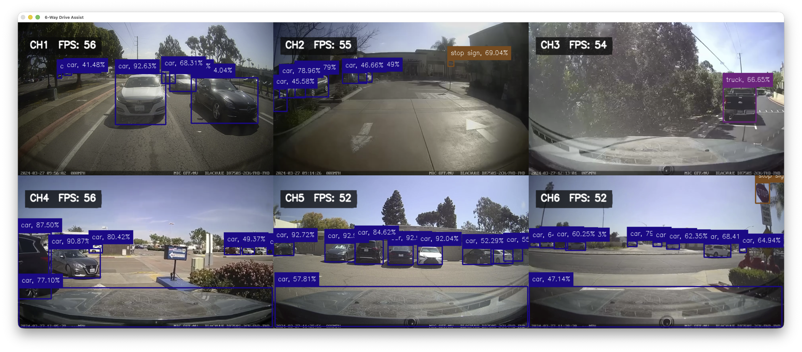
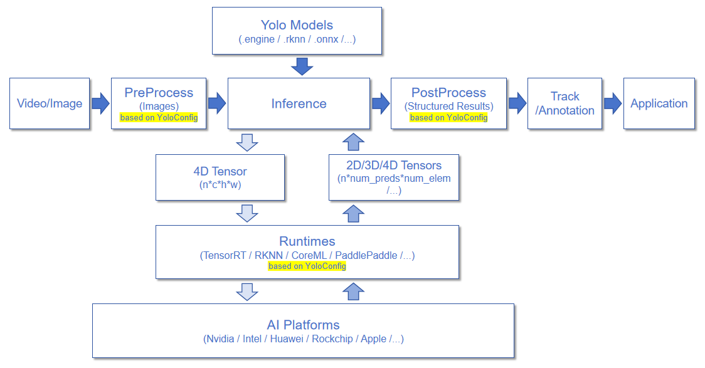

<p style="" align="center">
  
</p>
<p style="" align="center">
  
</p>
<p style="margin:0px;color:gray" align="center">
[🚀🚀🚀CoreML Yolo🚀🚀🚀]
</p>
<p style="margin:0px" align="center">
  <a href='./README_CN.md'>中文README</a>
</p>

# coreml yolo c++ objective-c++ one-yolo-coreml 
A unified C++ and Objective-C++ toolkit for YOLO `v5/v8/v11/v26/...`, covering `classification/detection/segmentation/pose/obb` tasks with easy python-like APIs from `ultralytics/ultralytics`. Support `All Yolo Tasks, All Yolo Versions, All Yolo Runtimes`, it's time to make all in one.

## ✨ highlight
1. demo code supprots `Yolo` tasks like `detection`/ `obb`.
2. support all `Yolo` versions including `yolov5(anchor-based)`/`yolov5u(anchor-free)`/`yolov8`/`yolov11`/`yolov26(nms-free)`/`more in the future`, sub versions like `n/s/m/l/x` are also supported.
3. supports `CoreML` `Yolo` backends(runtime)  
4. easy APIs to use and integrate, as simple as python APIs from `ultralytics/ultralytics` library.
5. toolkit works out of box, provide the model and set up the config parameters, go predict!

## Requirements
It is tested on Apple Silicon macs with 64GB UM on 6 and 8way video running 54 and 42 fps avg.

## 🚀 quick start

### basics
1. C++ >= 17
2. GCC >= 7.5 or clang
3. OpenCV == 4.13
4. CUDA/ONNXRuntime/TensorRT/OpenVINO/RKNN/... are optional

### build
1. run `git clone https://github.com/edselmalasig/one-yolo-coreml.git`
2. run `cd one-yolo && mkdir build-macos && cd build-macos`
3. run `cmake .. && make -j8` 

```
build options when run cmake command:
-DBUILD_WITH_CML=ON   # enable CoreML(Apple Platform) as inference backend
-DBUILD_WITH_PDL=ON   # enable PaddlePaddle as inference backend
-DBUILD_WITH_CAN=ON   # enable CANN(HuaWei Platform) as inference backend
-DBUILD_WITH_DEL=ON   # enable Denglin's SDK(Denglin/登临 Platform) as inference backend
-DBUILD_WITH_CAB=ON   # enable Cambricon'SDK(Cambricon/寒武纪 Platform) as inference backend
...

if you just run `cmake ..` without any options, 
one-yolo will depend on OpenCV::DNN module as inference backend by default,
so OpenCV is required for one-yolo, CUDA is optional when building OpenCV from source code. 
```
### To run you must convert yolo models to mlpackage
you can get yolo models .pt from http://www.ultralytics.com

1. `pip install ultralytics`
2. `yolo export model=yolo26n.pt format=coreml`
3. copy the assets folder to build-macos/samples
4. `cd build-macos/samples`
5. `mkdir models`
6. move the converted .pt package... the .mlpackage to the models directory
7. run the executable from the terminal 

### asset videos
can be found in assets folder

## 🆒 architecture diagram

